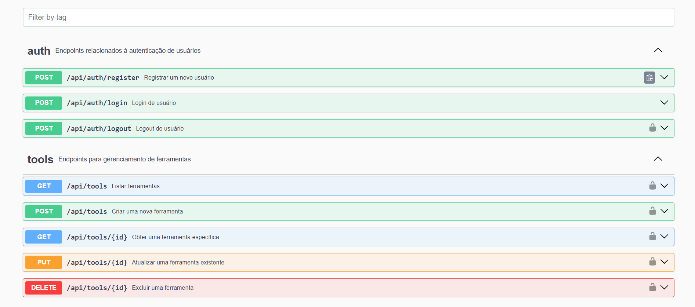

# FEMAQUA - API REST para Gerenciamento de Ferramentas

Bem-vindo à **FEMAQUA** (Ferramentas Maravilhosas Que Adoro), um repositório simples para gerenciar ferramentas. Este projeto é uma API REST desenvolvida em Laravel como parte de um teste backend. A aplicação permite o cadastro de usuários, autenticação via token e o gerenciamento de ferramentas.

## Sumário

- [Descrição do Projeto](#descri%C3%A7%C3%A3o-do-projeto)
- [Tecnologias Utilizadas](#tecnologias-utilizadas)
- [Requisitos](#requisitos)
- [Instalação](#instala%C3%A7%C3%A3o)
- [Estrutura de Endpoints](#estrutura-de-endpoints)
- [Instruções de Execução](#instru%C3%A7%C3%B5es-de-execu%C3%A7%C3%A3o)
- [Testes](#testes)
- [Documentação](#documenta%C3%A7%C3%A3o)

## Descrição do Projeto

O objetivo do projeto **FEMAQUA** é fornecer uma API para gerenciar um repositório de ferramentas. A API oferece funcionalidades de criação, visualização, edição e exclusão de ferramentas, além de autenticação de usuários via tokens.

As ferramentas possuem os seguintes atributos:

- Nome
- Link
- Descrição
- Tags

## Tecnologias Utilizadas

- [Laravel 11](https://laravel.com/)
- [Docker](https://www.docker.com/)
- [PostgreSQL](https://www.postgresql.org/)
- [L5-Swagger](https://github.com/DarkaOnLine/L5-Swagger)
- [Pest](https://pestphp.com/)

## Requisitos

Para executar o projeto, você precisará dos seguintes requisitos:

- **PHP** >= 8.2
- **Composer**
- **Docker** (para gerenciamento do banco de dados)
- **Servidor web** (Nginx ou Apache, por exemplo)

## Instalação

Siga os passos abaixo para instalar e configurar o projeto localmente:

1. Clonar o repositório:

```bash
git clone https://github.com/willamemouzinho/femaqua-api
cd femaqua-api
```

2. Renomeie o arquivo `.env.example` para `.env`:

```bash
mv .env.example .env
```

Em seguida, edite a variável `APP_URL` no arquivo `.env` para corresponder ao seu ambiente local:

```dotenv
APP_URL=http://localhost
```

3. Rode o comando abaixo para instalar todas as dependências do projeto:

```bash
composer install
```

4. Crie uma chave de criptografia para a aplicação:

```bash
php artisan key:generate
```

5. Utilize o Docker para levantar o banco de dados PostgreSQL:

```bash
docker compose up -d
```

6. Execute as migrações para criar as tabelas no banco de dados:

```bash
php artisan migrate
```

Agora, o projeto está configurado e pronto para uso.

## Estrutura de Endpoints

Aqui estão os principais endpoints da API para gerenciar as ferramentas:

### Autenticação

A API utiliza **Laravel Sanctum** para autenticação via token. Para acessar os endpoints protegidos, é necessário fazer login e obter um token de autenticação.

- `POST /api/auth/register` - Registrar um novo usuário e obter o token.
- `POST /api/auth/login` - Fazer login e obter o token.
- `POST /api/auth/logout` - Realizar logout e invalidar o token.

### Ferramentas

Ao fazer requisições a essas rotas, o token deve ser incluído no cabeçalho `Authorization` como um `Bearer` token (os tokens tem tempo de expiração de uma semana).

- `POST /api/tools` - Criar uma nova ferramenta.
- `GET /api/tools?tag=&page=` - Listar, de forma paginada, todas as ferramentas do usuário com opção de filtro por tag.
- `GET /api/tools/:id` - Exibir uma ferramenta específica (apenas o usuário que criou a ferramenta pode visualizá-la).
- `PUT /api/tools/:id` - Atualizar uma ferramenta existente (apenas o usuário que criou a ferramenta pode atualizá-la).
- `DELETE /api/tools/:id` - Deletar uma ferramenta (apenas o usuário que criou a ferramenta pode apagá-la).

## Instruções de Execução

Para rodar o projeto localmente, siga estas etapas:

1. Certifique-se de que o Docker está em execução.
2. Suba os contêineres com o seguinte comando:

```bash
docker compose up -d
```

3. Rode o servidor de desenvolvimento do Laravel:

```bash
php artisan serve
```

O servidor estará disponível em `APP_URL`, por exemplo, `http://localhost:8000`.

## Testes

Execute os testes (de feature) rodando o comando abaixo:

```bash
php artisan test
```

## Documentação

Para acessar a documentação Swagger (OpenAPI 3.0) navegue até o endereço `APP_URL/api/docs` no seu navegador, por exemplo, <http://localhost:8000/api/docs>.



Com 💜 By Willame Mouzinho
